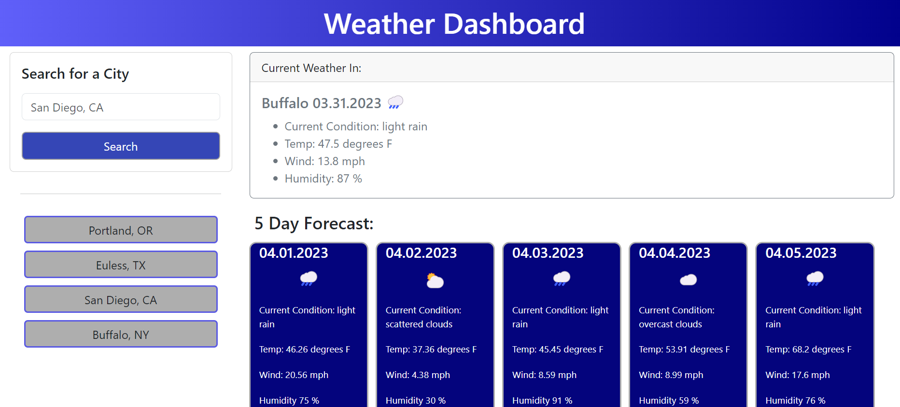

# Weather-Dashboard
Web application which displays current and future conditions for a given city.

## Description
This web application was designed to assist a user in easily finding the current and future weather conditions of a given city. By using this application, the user will have his or her search history automatically saved so that the user can easily find the weather conditions for the selected city. 

## Installation
N/A

## Usage
This web application will take a given city and output the current weather conditions as well as the 5 day forecast for that city. It will automatically save the user's search history to the lefthand side of the page and the user can then click on any saved searches to display the selected city's weather conditions (both current and 5 day forecast). 

To view the depolyed application click [here.](https://shannonkprice00.github.io/weather-dashboard/)

To find the weather conditions for a city, type the city, state into the search bar as indicated. The current and future conditions will automatically show. The user can also click on the saved search history which will automatically populate to the left side of the page under the search box.  

  

## Credits
For Loop Assistance for API Data: Tutor Chris Baird 
Worked with classmate Jen Wariner 
Worked with mentor Jahn Swob to display previously searched cities without repeating previously appended cities.  

## License
MIT License
